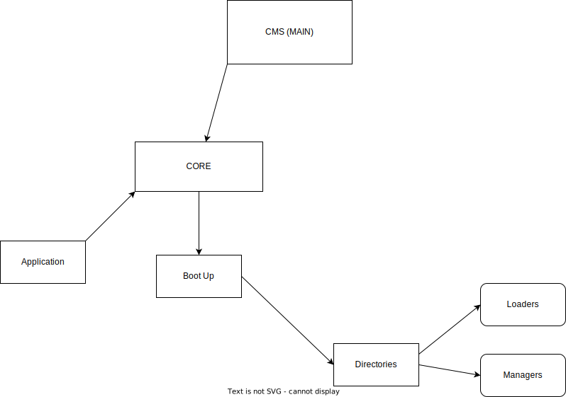

# Full structure is in https://python-webcms.readthedocs.io/en/latest/

# Structure


# Install deps + run tests
- `{python-executable} setup.py`
# IF BCRYPT FAILS, install this: [Here](https://stackoverflow.com/questions/44951456/pip-error-microsoft-visual-c-14-0-is-required)
# Start Webserver
- for mac/linux: `python3 main.py`

- for windows `py main.py` or `python main.py`

- to get crashreport run `start.py`
### Project in development, so debug mode is active

***

## Config.ini template

**For Mysql Driver**
```editorconfig
[DATABASE]
Driver = MySql
Host = localhost
Name = CMSProj
User = root
Password = root
Port = 8889

[DEVELOPMENT]
Debug = on
Host = 127.0.0.1
Port = 5000
```
**For SQLite Driver**
```editorconfig
[DATABASE]
Driver = Sqlite
Path = /path/to/database

[DEVELOPMENT]
Debug = on
Host = 127.0.0.1
Port = 5000
```
